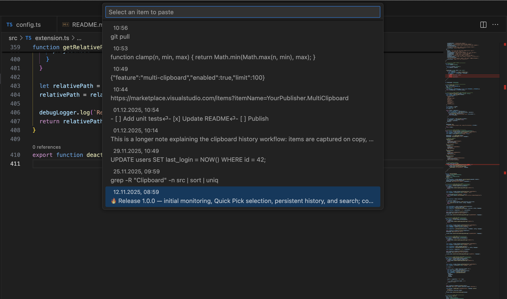

# MultiClipboard for VS Code

A simple clipboard history manager for Visual Studio Code. It automatically tracks copied text and lets you quickly select and paste any previous entry.

## ✨ Features

- **Automatic clipboard monitoring** — Tracks all text copied to the system clipboard
- **Up to 100 history entries** — Stores recent clipboard items
- **Smart duplicate detection** — Ignores consecutive duplicates and empty values
- **Time‑aware display**:
  - Shows time only for today's entries
  - Shows full date and time for older entries
- **Quick Pick search** — Filter and select items via VS Code’s Quick Pick
- **Persistent history** — Saved between VS Code restarts

## 🚀 Usage

### Open clipboard history

- Keyboard shortcut:
  - Windows/Linux: `Ctrl+Shift+V`
  - macOS: `Cmd+Shift+V`
- Command Palette:
  1. `Ctrl+Shift+P` (macOS: `Cmd+Shift+P`)
  2. Type: `MultiClipboard: Show History`
  3. Press Enter

### Select and paste

1. Open the clipboard history
2. Browse or type to search
3. Press Enter to paste the selected item

## How it works

- The extension periodically checks the system clipboard.
- When the text changes and isn’t empty:
  - It’s added to the beginning of the history
  - Consecutive duplicates are ignored
- History is stored in VS Code `globalState`
- Pasted items move to the top of the list

## Privacy

- Clipboard history is stored locally in VS Code’s global state
- No data is sent to third parties
- You can clear the history by removing extension data or reinstalling the extension

## Feedback and contributions

Found a bug or have an idea? [Open an issue](https://github.com/CodeImm/multiclipboard-vscode/issues).

## License

Licensed under the [MIT License](./LICENSE).

## Changelog

See [CHANGELOG.md](./CHANGELOG.md).

## 📸 Screenshots

### Clipboard History Quick Pick

